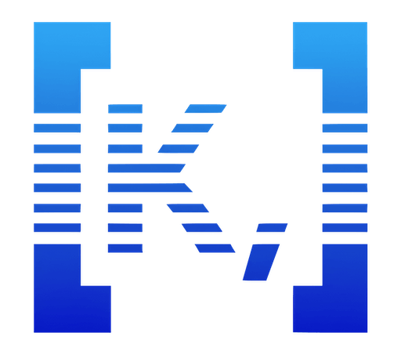
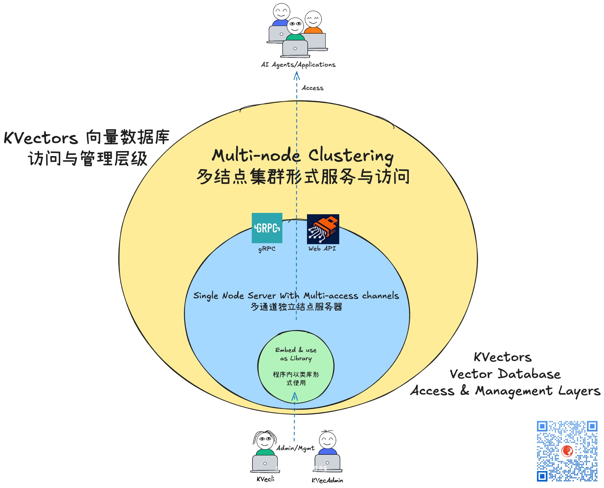
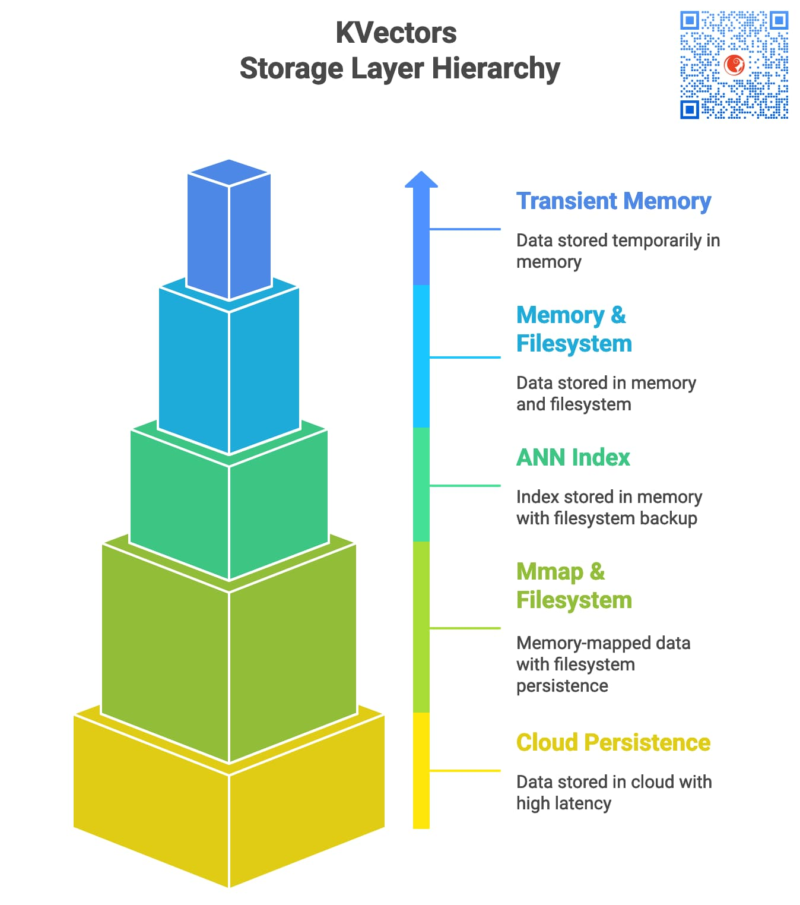
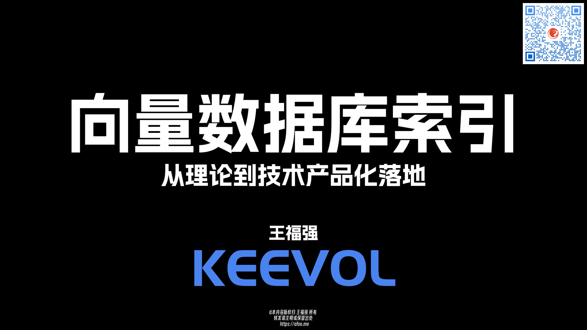
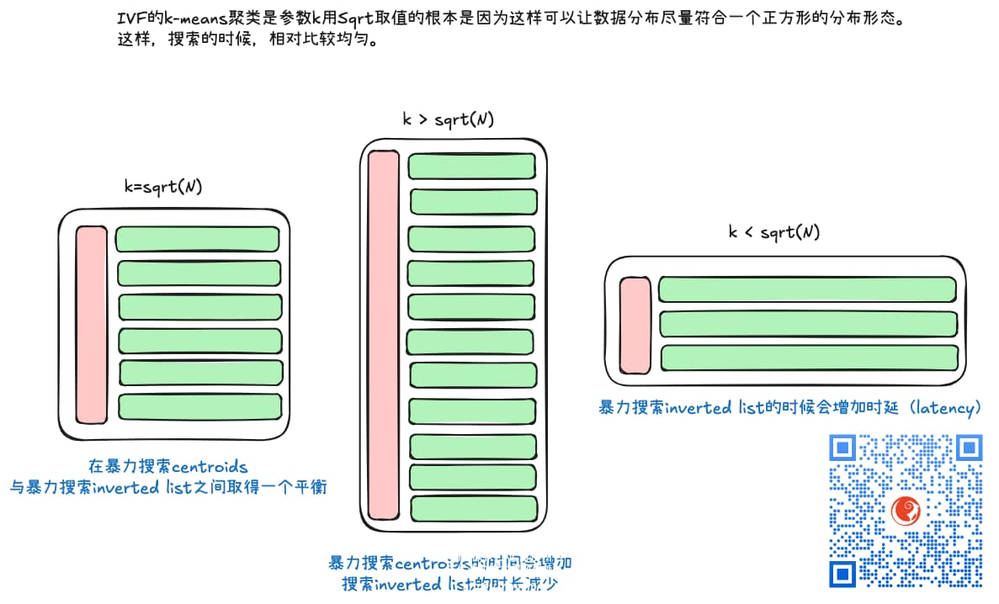

# Intro


KVectors is a vector store implemented by pure java (Scala 2.12 in fact 🤣).



```
██╗  ██╗ ██╗   ██╗ ███████╗  ██████╗ ████████╗  ██████╗  ██████╗  ███████╗
██║ ██╔╝ ██║   ██║ ██╔════╝ ██╔════╝ ╚══██╔══╝ ██╔═══██╗ ██╔══██╗ ██╔════╝
█████╔╝  ██║   ██║ █████╗   ██║         ██║    ██║   ██║ ██████╔╝ ███████╗
██╔═██╗  ╚██╗ ██╔╝ ██╔══╝   ██║         ██║    ██║   ██║ ██╔══██╗ ╚════██║
██║  ██╗  ╚████╔╝  ███████╗ ╚██████╗    ██║    ╚██████╔╝ ██║  ██║ ███████║
╚═╝  ╚═╝   ╚═══╝   ╚══════╝  ╚═════╝    ╚═╝     ╚═════╝  ╚═╝  ╚═╝ ╚══════╝
```

# Features

- Pure Java/Scala (Make Java Great Again 🤪)
- Single-node and Clustering support (Both Personal and Enterprise Grade Solution)
- Clean Architecture design and implementation
- CPU with SIMD will accelerate the computation and gain more performance.
- [Multiple storage layers](#kvectors-storge-layer-hierarchy) supported.
- Dot Product Similarity, Cosine Similarity and Euclidean distance Functions are supported
- Different indexing strategies for different scenarios
    - FLAT
    - HNSW
    - HNSW_PQ
    - IVF (improved IVF index with k-means++ for clustering)
    - IVF_RABITQ
    - Hyperplanes LSH (a memory killer 😆)
- [Multiple access and management channels](#kvectors-access--management-layer) support
    - Admin web console inlined (may be separated into a standalone app in the future?)
    - Web API and gRPC service inlined.
    - **kvecli** terminal commandline client available
- easy to ops (one-jar)
    - log/trace/metrics support inlined (dropwizard and open telemetry)

# KVectors Access & Management Layer



# KVectors storge layer hierarchy

KVectors offers different storage-layer vector collections for different scenarios,

latency varies from **less than 10ms** to greater than 500ms, you can choose specific vector collection as per your
need.



# Use cases

mostly, embedding scenarios. say, Search image as per Image(以图搜图), product recommendation(商品推荐), knowledge base
for customer service, etc.

Locally, we can use light-weight models like MobileNetV2(..4), GemmaEmbedding, CLIP-ViT-B-32, Qwen3 embedding 0.6b(or
4b,8b), etc.

# Training

We also provide corresponding training on KVectors and Vector Database design and implementation.




Find more details at [https://keevol.cn](https://keevol.cn)

# common data reference

- 1000000 (1 million) vectors of 1024 dimension occupy 3.81 Gb disk capacity.
    - 1 full-precision vector of 1024 dimension takes 4 Kb capacity.
- At IVF indexing, the k in k-means clustering usually uses `sqrt(N)` as the parameter value, because that will get a
  proper data distribution.
    - 
    - IVF is suitable for scenarios of data volume larger than 1million or 10
      million（IVF适合数据量大于百万级别甚至千万级别的场景，少于10万的场景，内存里暴力搜索就足够了。）

# evolution history

1. 第一版纯粹验证内存极限
2. 第二版加入ANN索引（HNSW+DiskANN)
3. 第三版重塑整体设计
    - db-collection-store三级概念
    - 存储与索引分离


