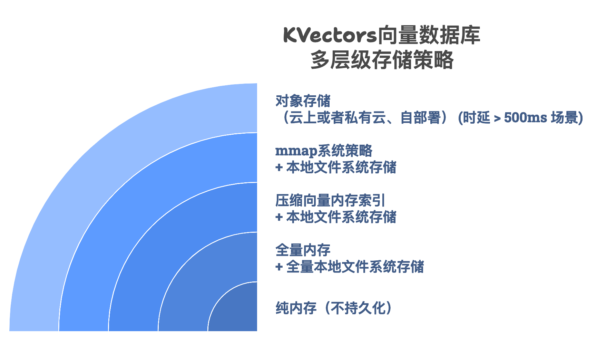

% KVectors设计与使用手册
% 王福强
% 2025-10-10

## 整体设计演化 

1. 第一版纯粹验证内存极限
2. 第二版加入ANN索引（HNSW+DiskANN)
3. 第三版重塑整体设计
    - db-collection-store三级概念
    - [存储与索引分离](#关于索引框架的演化)


## 关于Vector Collections的创建

第一版虽然看似粗糙，但基本实现了功能闭环，支持基于内存的无索引检索 + 基于HNSW的近似检索，这两个已经基本满足大部分企业的需求和场景。Weaviate
也只是支持了这两种索引类型就已经算一个完备的向量数据库了。

不过， 我们在这个基础上还多加了一个基于文件系统存储向量的实现，但鉴于latency因素的考虑，并不推荐在高频低时延场景使用。

但不管怎么样， FLAT 和 HNSW 索引是现在业界主流的向量数据库索引形式。



第二版尝试对KVectors启动时候向量集合的加载逻辑进行重构， 但后来发现不够优雅，有新的Vector
Collections类型新增的时候，也比较繁琐，所以，最后将其转入了@Deprecated状态。

第三版引入了新的索引相关的设计，并同时也引入了新的Vector Collections创建机制，基于 KVectorCollectionCreator 抽象对所有Vector
Collection的创建进行封装，自由度更高、封装度也更好。 在这个基础上，我们配合在具体Vector Collection的实现，
在其Companion object上加载PartialFunction控制逻辑， 从而既保留了具体每个Vector Collection的特点与配置和创建细节，同时又能通过一个很简单的
**链式结构**将它们在KVectors向量数据库启动的时候顺利初始化：

```scala
val vectorCollection: KVectorCollection = Option(collectionDir).collect(IVFIndexedKVectorCollection orElse HyperplanesLshKVectorCollection) match {
  case Some(vc) => vc
  case None => // fallback to 1st revision of vector collection initialization
}
```


## 关于索引框架的演化

最早索引与否这个行为是跟具体Vector
Collection实现绑定的，在第一版里，因为重点是攻克JVector的集成，所以，很多逻辑是耦合在一起的，比如AnnIndexKVectorCollection，基本上将Vector
Collection、Index、Vector Store、MetaStore等所有关注点都耦合在一个类中。

经过测试和改进，这种设计当然不在存在bug，也趋于稳定了，但它的设计受限于最早的诉求，保持了过于耦合的结构，如果后面有其它需求和改进，在维护上可能会一些tricky。

不过暂时我们维持它的现状，以保证功能的持续稳定。

后面我们对Index相关的关注点进行了抽象，将其分成了`Builder - Index - IndexStore`三个主要功能角色组成的结构，从而整个设计也变得更加清晰：


- IndexBuilder是单向单次操作，它负责Index的创建逻辑（Computation）
- Index只保存具体索引相关的所有状态，它是没有任何计算逻辑的（State）
- IndexStore只有两个操作，save和load，它只负责Index的保持与加载（IO）

在这样的框架下，如何使用Index的职责，就交给了具体的Vector Collection实现。

整个的设计遵循福强老师一贯的架构原则： **外部化**


## 关于集群化与单节点

KVectors设计初衷其实是面向单节点的， 虽然也陆续添加了Web API 和 gRPC API的支持，甚至也添加了基于静态节点集合的集群支持和测试，但这些其实更多面向的是将来可能的一些潜在市场需求而设计实现的，并非设计初衷。

一旦牵扯集群和分布式，就得引入更多人来研发、测试、维护和运维保障。这个阶段需要业务稳定并且公司业务处于明确增长趋势的情况下才会做。

内嵌的Web Admin其实也是基于面向单节点的初衷而加入的，不过，因为不是核心关键，所以，新增了一个configuration option，默认将其关闭。

还有就是，kvecli是一个命令行工具，也是基于单节点本地状态进行连接和操作的。

总之，现在的设计实现是monorepo的，后期如果有需求，可以根据关注的分离为独立的repo，比如：

1. core        (单节点服务)
2. api        （API抽象依赖，比如gRPC的stub）
3. clustering （集群节点与协调相关）
4. web-admin  （独立的web管理后台）
5. kvecli     （命令行管理工具）
6. kvecops     (独立运维平台)
7. embedding service (optional, mainly as a MaaS)

## KVectors的访问与使用方式

KVectors支持多种使用与访问方式：


首先， KVectors本身可以作为类库使用，只要是JVM生态的语言，都可以将KVectors作为一个类库进行调用，也就是内嵌模式。

其次，KVectors针对单节点有成熟的设计和支持，不但提供了单节点下的Web API与gRPC 访问支持，还提供了一个简单的Web Admin供管理员简单查询和验证结果。

最后，KVectors还提供初步集群支持，允许用户使用固定静态节点的集群来支撑更大量的数据存储和访问。 

当然，如果后面用户对基于consul/etcd/zookeeper等中间件的集群协调需求，KVectors的集群设计也支持无缝接入。

> TIP
> 
> 对于API的访问，可以单独访问节点所在的`{IP}:1980`端口的api文档，会有详细的API使用说明。


